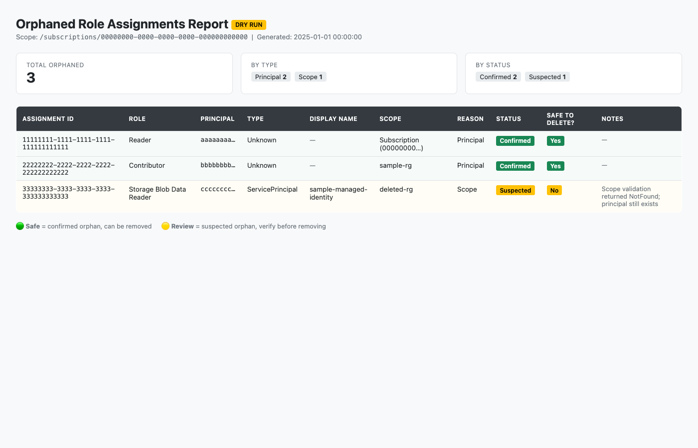
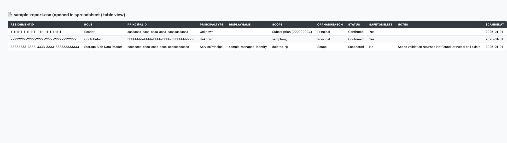

# Orphaned Role Assignment Scanner

Azure Function App (PowerShell) that detects and optionally removes orphaned Azure RBAC role assignments on a schedule, with an integrated Azure Monitor Workbook dashboard.

> Repo: [chadray/azure-orphaned-roles-resources](https://github.com/chadray/azure-orphaned-roles-resources)

## What It Detects

| Type                   | Description                                                                          | Detection Method                                                                                        |
| ---------------------- | ------------------------------------------------------------------------------------ | ------------------------------------------------------------------------------------------------------- |
| **Orphaned Principal** | The Entra ID identity (user, group, service principal, managed identity) was deleted | `ObjectType -eq "Unknown"` + confirmation via `Get-AzADServicePrincipal`/`Get-AzADUser`/`Get-AzADGroup` |
| **Orphaned Scope**     | The Azure resource the assignment targets no longer exists                           | Scope-type-aware validation (management group, subscription, resource group, resource)                  |

## Report Output

Every run produces a JSON report with:

- **ReportMetadata** — timestamp, scope, counts by orphan type, detection confidence breakdown
- **OrphanedAssignments** — full details per assignment:
  - `RoleAssignmentId`, `RoleDefinitionName`, `PrincipalId`, `Scope`
  - `OrphanReasons` — `OrphanedPrincipal`, `OrphanedScope`, or both
  - `DetectionStatus` — `Confirmed` or `Suspected`
  - `CanSafelyDelete` — only `true` when detection is `Confirmed`
- **CleanupResults** — action taken per assignment (`Deleted`, `WouldDelete`, `Skipped`, `Failed`)

Reports are written to Function App logs and optionally to Azure Blob Storage.

### Azure Monitor Workbook Dashboard

The recommended way to visualize results is the integrated **Azure Monitor Workbook**. It combines orphaned RBAC role assignments (from the Function App scan) with orphaned Azure resources (via Azure Resource Graph) in a single dashboard.

The workbook is based on [dolevshor/azure-orphan-resources](https://github.com/dolevshor/azure-orphan-resources) (MIT license) and extended with a **Security** tab for orphaned role assignments.

**Tabs included:**

| Tab | Data Source | Content |
|-----|-------------|---------|
| Overview | Resource Graph + Log Analytics | Tile counters for all orphaned resource types |
| Compute | Resource Graph | App Service Plans, Availability Sets |
| Storage | Resource Graph | Managed Disks |
| Database | Resource Graph | SQL Elastic Pools |
| Networking | Resource Graph | Public IPs, NICs, NSGs, Route Tables, Load Balancers, etc. |
| Others | Resource Graph | Resource Groups, API Connections, Certificates |
| **Security** | **Log Analytics** | **Orphaned role assignments — scan summary, pie charts, detail table** |

> ℹ️ The Security tab shows scan-based data (updated each Function App run), not real-time Resource Graph data. The workbook surfaces the last scan timestamp prominently.

#### Deploying the Workbook

See [workbooks/README.md](workbooks/README.md) for full instructions. Quick start:

1. Navigate to **Azure Monitor → Workbooks → + New → Advanced Editor**
2. Select **Gallery Template** and paste the contents of [`workbooks/azure-orphaned-resources.workbook`](workbooks/azure-orphaned-resources.workbook)
3. Click **Apply → Save**
4. Select your **Subscription(s)** and **Log Analytics Workspace** from the filter bar

#### Setting Up Log Analytics Ingestion

The Function App pushes scan results to Log Analytics via the [Logs Ingestion API](https://learn.microsoft.com/en-us/azure/azure-monitor/logs/logs-ingestion-api-overview) using managed identity (no shared keys).

**Prerequisites:**

1. **Log Analytics Workspace** — create one or use an existing workspace
2. **Custom tables** — create `OrphanedRoleAssignments_CL` and `OrphanedRoleScanSummary_CL` in the workspace
3. **Data Collection Endpoint (DCE)** — create a DCE in the same region as the workspace
4. **Data Collection Rule (DCR)** — create a DCR that maps the ingestion streams to the custom tables
5. **RBAC** — grant the Function App's managed identity `Monitoring Metrics Publisher` on the DCR

**Configure the Function App** with these settings:

| Setting | Value |
|---------|-------|
| `LOG_INGESTION_DCE_URI` | `https://<dce-name>.<region>.ingest.monitor.azure.com` |
| `LOG_INGESTION_DCR_IMMUTABLE_ID` | `dcr-xxxxxxxxxxxxxxxxxxxxxxxxxxxxxxxx` |
| `LOG_INGESTION_STREAM_NAME` | `Custom-OrphanedRoleAssignments_CL` |
| `LOG_INGESTION_SUMMARY_STREAM_NAME` | `Custom-OrphanedRoleScanSummary_CL` |

When these settings are configured, the Function App will automatically push scan results (including zero-result scans) to Log Analytics after each run. If ingestion fails, scan results are still available in logs and blob storage.

### Converting Reports to CSV / HTML

The `scripts/convert-report.py` script converts a JSON report into user-friendly CSV and HTML formats. No external dependencies — just Python 3.

```bash
# Generate both CSV and HTML (default)
python3 scripts/convert-report.py sample-report.json

# CSV only
python3 scripts/convert-report.py report.json --no-html

# HTML only
python3 scripts/convert-report.py report.json --no-csv

# Custom output paths
python3 scripts/convert-report.py report.json --csv results.csv --html results.html
```

**HTML report** — self-contained dashboard with summary cards and a color-coded table (green = safe to delete, yellow = needs review):



**CSV report** — flat table that opens directly in Excel, Google Sheets, or any spreadsheet tool. Includes shortened IDs, friendly scope names, and clear Yes/No safe-to-delete values:



## Safety Features

- **Dry-run by default** — no deletions occur unless explicitly enabled via app settings
- **Tri-state scope validation** — only flags `NotFound` as orphaned; permission errors and ambiguous results are not treated as orphaned
- **Principal confirmation** — secondary Entra ID lookups confirm deletion beyond the `Unknown` ObjectType signal
- **Confidence-gated deletion** — only `Confirmed` orphans are eligible for cleanup; `Suspected` items are reported but never deleted
- **Granular cleanup toggles** — principals and scopes can be enabled/disabled independently

## Required Permissions

The Function App's managed identity needs:

| Permission                                       | Purpose                                    |
| ------------------------------------------------ | ------------------------------------------ |
| `Reader` at target scope                         | Read resources for scope validation        |
| `Microsoft.Authorization/roleAssignments/read`   | Enumerate role assignments                 |
| `Microsoft.Authorization/roleAssignments/delete` | Remove orphaned assignments (cleanup only) |
| `Directory.Read.All` or equivalent Entra ID read | Confirm principal existence                |
| `Monitoring Metrics Publisher` on DCR            | Push results to Log Analytics (dashboard only) |

> **Recommended role for scan-only**: `Reader` + custom role with `Microsoft.Authorization/roleAssignments/read`
> **Recommended role for cleanup**: `User Access Administrator` at the scan scope
> **Workbook viewers** need: `Reader` on subscriptions + `Log Analytics Reader` on the workspace

## App Settings

| Setting                              | Default                                  | Description                                      |
| ------------------------------------ | ---------------------------------------- | ------------------------------------------------ |
| `ORPHANED_ROLES_SCAN_SCOPE`          | `/`                                      | Azure scope to scan                              |
| `ENABLE_ROLE_ASSIGNMENT_CLEANUP`     | `false`                                  | Set to `true` to enable the cleanup phase        |
| `CLEANUP_ORPHANED_PRINCIPALS`        | `false`                                  | Allow deletion of orphaned-principal assignments |
| `CLEANUP_ORPHANED_SCOPES`            | `false`                                  | Allow deletion of orphaned-scope assignments     |
| `REPORT_OUTPUT_BLOB_CONTAINER`       | `orphaned-role-reports`                  | Blob container for report output                 |
| `LOG_INGESTION_DCE_URI`              | *(empty — disables ingestion)*           | Data Collection Endpoint URI                     |
| `LOG_INGESTION_DCR_IMMUTABLE_ID`     | *(empty — disables ingestion)*           | Data Collection Rule immutable ID                |
| `LOG_INGESTION_STREAM_NAME`          | `Custom-OrphanedRoleAssignments_CL`      | DCR stream for assignment detail records         |
| `LOG_INGESTION_SUMMARY_STREAM_NAME`  | `Custom-OrphanedRoleScanSummary_CL`      | DCR stream for scan summary records              |

## Deployment

### One-Command Deploy

The included deploy script provisions all Azure infrastructure and publishes the Function App in a single command:

```bash
./scripts/deploy.sh -g rg-orphaned-roles -s <subscription-id>
```

This creates:
- **Resource Group** (if it doesn't exist)
- **Storage Account** — Function App runtime + report blob storage
- **App Service Plan** — Consumption tier (Y1)
- **Function App** — PowerShell 7.4 with system-assigned managed identity
- **Application Insights** — linked to Log Analytics
- **Log Analytics Workspace** — with custom tables for scan data
- **Data Collection Endpoint + Rule** — for Logs Ingestion API
- **Azure Monitor Workbook** — dashboard with Security tab
- **Role Assignments** — Reader at scan scope + Monitoring Metrics Publisher on DCR

Options:

```bash
./scripts/deploy.sh -g <resource-group> -s <subscription-id> [-l <location>] [-n <base-name>]

  -g    Resource group name (created if needed)
  -s    Subscription ID to scan
  -l    Azure region (default: eastus)
  -n    Base name for resources (default: orphroles)
```

### Manual / Customized Deploy

If you prefer to deploy step-by-step:

```bash
# 1. Deploy infrastructure
az deployment group create \
  --resource-group <RG> \
  --template-file infra/main.bicep \
  --parameters scanScope=/subscriptions/<sub-id>

# 2. Publish Function App code
func azure functionapp publish <FunctionAppName> --powershell

# 3. Import workbook manually via Azure Portal
#    (Azure Monitor → Workbooks → + New → Advanced Editor → paste workbook JSON)
```

### Post-Deployment

The deploy script handles most permissions, but you still need to grant **Entra ID read access** for principal validation:

```bash
# Grant Directory.Read.All to the Function App's managed identity
# (requires Global Administrator or Privileged Role Administrator)
az ad app permission add \
  --id <function-app-app-id> \
  --api 00000003-0000-0000-c000-000000000000 \
  --api-permissions 7ab1d382-f21e-4acd-a863-ba3e13f7da61=Role
```

### Prerequisites

- Azure CLI with Bicep (`az bicep install`)
- Azure Functions Core Tools v4 (`npm install -g azure-functions-core-tools@4`)
- An Azure subscription with Owner or Contributor + User Access Administrator

### Local Development

```bash
# Clone the repo
git clone https://github.com/chadray/azure-orphaned-roles-resources.git
cd azure-orphaned-roles-resources

# Install Azure Functions Core Tools
npm install -g azure-functions-core-tools@4

# Copy the sample local settings and adjust if needed
cp local.settings.json.sample local.settings.json

# Sign in to Azure (the local runtime uses your Az context)
pwsh -Command 'Connect-AzAccount'

# Run locally
func start
```

A sanitized example of the JSON report produced by a scan lives in [sample-report.json](sample-report.json).

## Standalone Usage

The module can be used independently outside the Function App:

```powershell
Import-Module ./modules/OrphanedRoleAssignments.psm1

# Scan only (no cleanup)
$orphaned = Find-OrphanedRoleAssignments -Scope '/'

# View results
$orphaned | Format-Table RoleDefinitionName, PrincipalId, Scope, OrphanReasons, DetectionStatus

# Dry-run cleanup (see what would be deleted)
$results = Remove-OrphanedRoleAssignments -OrphanedAssignments $orphaned -DryRun $true -CleanupPrincipals $true
$results | Where-Object Action -eq 'WouldDelete' | Format-Table

# Live cleanup (confirmed orphaned principals only)
$results = Remove-OrphanedRoleAssignments -OrphanedAssignments $orphaned -DryRun $false -CleanupPrincipals $true

# Generate full report
$report = New-OrphanedRoleReport -OrphanedAssignments $orphaned -CleanupResults $results
$report | ConvertTo-Json -Depth 10 | Out-File report.json
```

## Schedule

Default: daily at 6:00 AM UTC (`0 0 6 * * *`). Modify in `TimerTriggerOrphanedRoles/function.json`.

## Architecture

```
├── host.json                              # Function App host config
├── requirements.psd1                      # Az module dependencies
├── profile.ps1                            # Managed identity auth
├── local.settings.json.sample             # Template for local dev settings
├── sample-report.json                     # Example scan report (sanitized)
├── .funcignore                            # Files excluded from func publish
├── docs/
│   └── images/                            # Screenshots for README
│       ├── html-report.png
│       └── csv-report.png
├── infra/
│   ├── main.bicep                         # Azure infrastructure (all resources)
│   └── main.bicepparam                    # Parameter defaults
├── modules/
│   ├── OrphanedRoleAssignments.psm1       # Core detection & cleanup logic
│   └── LogAnalyticsIngestion.psm1         # Logs Ingestion API client
├── scripts/
│   ├── convert-report.py                  # JSON → CSV / HTML converter
│   ├── deploy.sh                          # One-command Azure deployment
│   ├── patch-workbook.py                  # Adds Security tab to vendored workbook
│   └── test-scan.ps1                      # Local dry-run harness
├── workbooks/
│   ├── azure-orphaned-resources.workbook  # Azure Monitor Workbook (patched)
│   └── README.md                          # Workbook attribution & deployment
└── TimerTriggerOrphanedRoles/
    ├── function.json                      # Timer trigger binding
    └── run.ps1                            # Function entry point
```

## Contributing

Issues and PRs are welcome. When opening a PR:

- Keep the module (`modules/OrphanedRoleAssignments.psm1`) free of Function-runtime-specific code so it stays reusable as a standalone PowerShell module.
- Do not commit `local.settings.json` or any scan output containing real subscription, tenant, or principal IDs — these are already excluded via `.gitignore`.
- Run `scripts/test-scan.ps1` against a dev subscription before submitting changes that touch detection logic.

## Disclaimer

This project is provided as-is, with no warranty. Cleanup of role assignments is irreversible — always run with `ENABLE_ROLE_ASSIGNMENT_CLEANUP=false` first and review the JSON report before enabling deletion.
